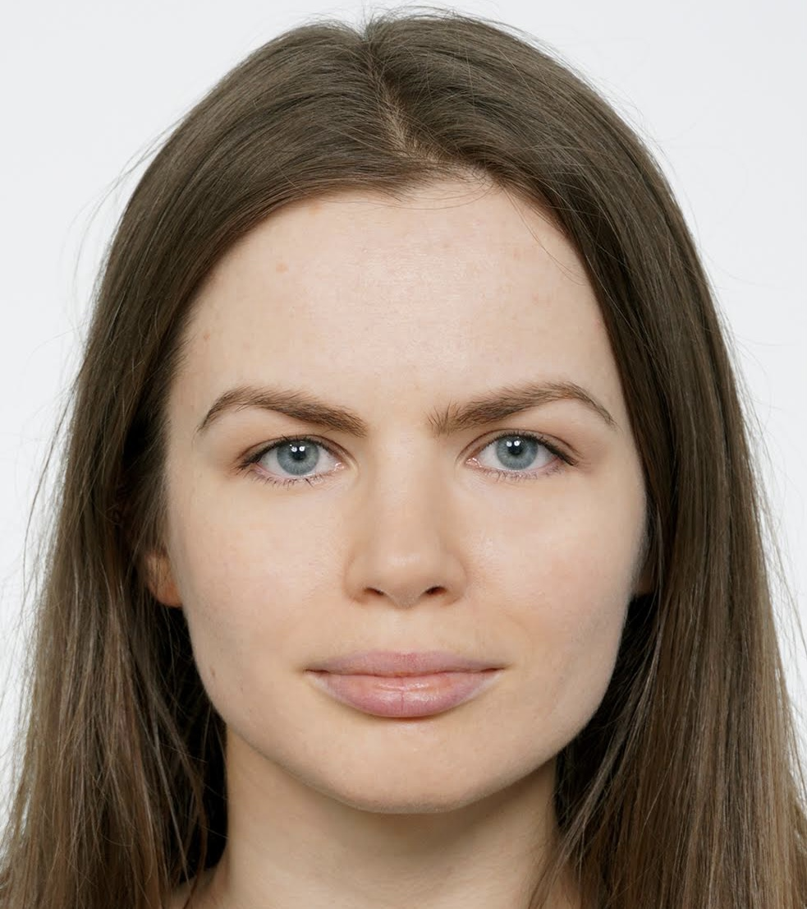

<div style="" id="header">
  
</div>

# Junior Frontend Developer
## Valeryia Bessonava

____________________________________________________________
## How to reach me: [](http://www.linkedin.com/in/whowouldwin), [](https://t.me/leranetwork), [](https://github.com/whowouldwin), [](https://discordapp.com/users/@whowouldwin#2891)
____________________________________________________________
##  Executive Summary

- [x] I'm applying for the position of Front-End Developer associate with the requirements for L1 position. 
2. [x] Bachelor's degree in Programmable Mobile Systems
3. [x] Completed numerous coding challenges on Codewars platform
4. [x] I am an expert in visually interpreting information using mind maps and helping others better understand and retain information.
5. [x] Skills and Proficiency:     
6. [x] I’m currently learning:     


## Working Experience

#### 1C Developer (SoftBel, 08/2020 - 03/2021)

* Implementation and refinement of configurations based on the 1C 8.3 platform.
* I have worked in accounting-related roles and have experience solving accounting-related problems.


## Projects 

* [BotTee: Deploy](https://whowouldwin.github.io/PaymentForm/) - a project simulating payment and shipping (API, data management, testing )
* [Flower Search](https://whowouldwin.github.io/FlowerSearch/) - a project including responsive layout, navigation, form, and Font Awesome.

## Education & Qualifications 

| Description                                                                                                             | Years             |
|-------------------------------------------------------------------------------------------------------------------------|-------------------|
| **Belarusian State University of Informatics and Radioelectronics**<br/>_Bachelor's degree, Programmable mobile system_ | 09/2017 - 03/2021 |
| **Belarusian Academy State Aviation**<br/>_Computer Operations Specialist, Computing machines, systems, and networks_   | 09/2012 - 07/2015 |


## Courses:
* [JS/FE PRE-SCHOOL 2022 (JAVASCRIPT)](https://app.rs.school/certificate/nqe6yxjx)
* [LinkedIn Learning - REST APIs](https://www.linkedin.com/learning/certificates/a286742208522c52b2356ad9083fa89c9834ffafc1d32680a1d17e359332582b?lipi=urn%3Ali%3Apage%3Ad_flagship3_profile_view_base_certifications_details%3BK3LRkJQAT9eRv%2BXWuMx1BA%3D%3D)
* [LinkedIn Learning - React](https://www.linkedin.com/learning/certificates/3981cc5db073d23054dff492e36ea96b0eaf1da4583e265db96e4ecae12b14a2?lipi=urn%3Ali%3Apage%3Ad_flagship3_profile_view_base_certifications_details%3BA8bJzH0oTO%2BQI3gCNiX9Wg%3D%3D)
* [Learning ECMAScript 6+ (ES6+)](https://www.linkedin.com/learning/certificates/0c6a9c22922046546cfc65767410bdaa5d46e95b8d8f4398abf67e54355656d4?lipi=urn%3Ali%3Apage%3Ad_flagship3_profile_view_base_certifications_details%3Bifi2NqpfTRmY6iCStE9zQA%3D%3D)

You can find detailed information about my additional education and courses on my  [](http://www.linkedin.com/in/whowouldwin) profile.

## Code Examples
```
function recursivePromise(promise) {
    return promise.then(()=> {
        console.log('promise 1');
        recursivePromise(Promise.resolve())
    })
}
recursivePromise(Promise.resolve())
setTimeout(()=>console.log('timeout'))
```


## Misc. Information

* Languages: English (B1) - according to the online test at EPAM, Polish(A2), Russian


